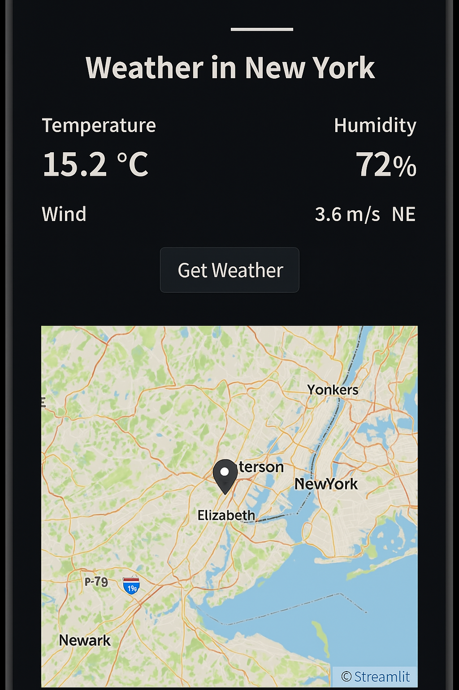

# Mobile Weather App ☁️🌡️

A mobile-friendly weather forecast app built with Streamlit. It supports:
- Temperature unit toggle (Celsius/Kelvin)
- Wind direction visualization
- Weather maps integration
- Dark mode support

## 🔥 Screenshot


## 🚀 Try it live
[Click here to open in Streamlit Cloud](https://mobile-weather-app-hzbcxo2q4yvealfp6rnqc8.streamlit.app/)

## 📦 Requirements
Install required packages with:

```bash
pip install -r requirements.txt
